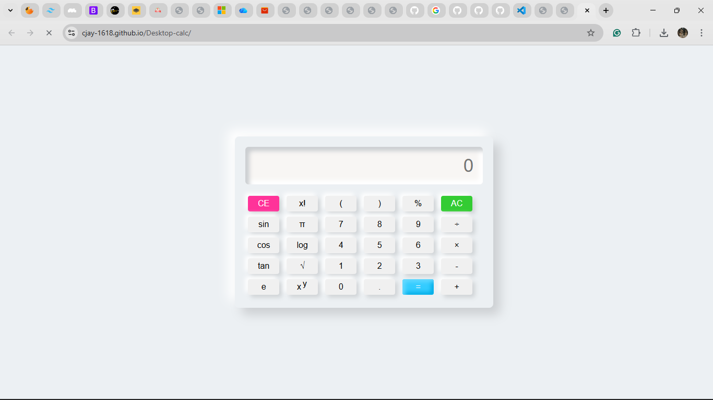

# Calculator Project

Small HTML/CSS/JS calculator located in this folder.

Live demo: [https://cjay-1618.github.io/Desktop-calc/](https://cjay-1618.github.io/Desktop-calc/)


How to push to your Git remote:

1. Create a repo on GitHub (or another host) and copy the remote URL.
2. In this folder run:

```powershell
```

If you want me to add the remote and push for you, provide the remote URL (HTTPS or SSH).

## Desktop Calculator

A simple, responsive calculator built with plain HTML, CSS and JavaScript.

- Live demo: https://cjay-1618.github.io/Desktop-calc/
- License: MIT




---

Summary
-------
This project is a lightweight calculator that supports basic arithmetic, parentheses, percentage, trigonometric functions, factorial, and a few math constants (π, e). It's implemented with vanilla front-end technologies so it's easy to read and reuse in interviews or a portfolio.

Features
--------
- Basic arithmetic (+, -, ×, ÷)
- Parentheses and decimal support
- Factorial, power, square root, log, sin/cos/tan
- Responsive layout and simple UI

Run locally
-----------
Open `index.html` in your browser (double-click the file) or run a simple static server from the project folder:

```powershell
# from project root
python -m http.server 8000
# then open http://localhost:8000/
```

Tech
----
- HTML, CSS, JavaScript (no frameworks)

Contributing
------------
Feel free to open issues or submit PRs. Keep changes small and include a short description of the purpose.

License
-------
This project is licensed under the MIT License — see the `LICENSE` file for details.

Contact
-------
GitHub: https://github.com/Cjay-1618

<!-- Trigger Pages rebuild -->
Last rebuilt: 2025-12-09  (trigger commit)
